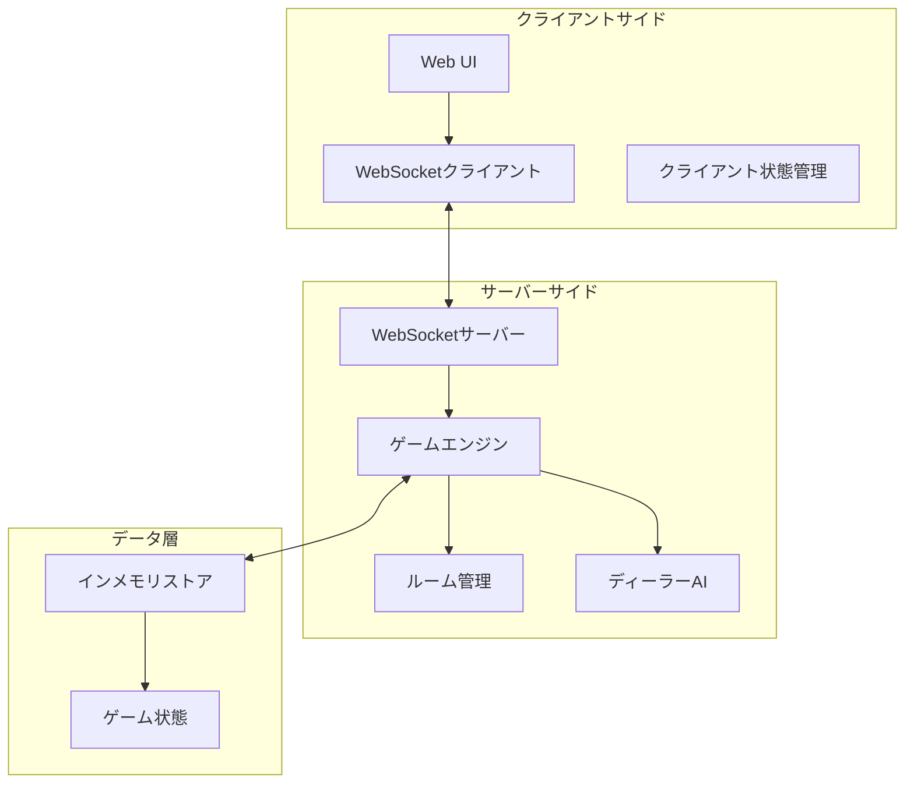

# 設計文書

## 概要

ブラックジャックマルチプレイヤーWebアプリケーションは、リアルタイム通信を活用した複数プレイヤー対応のカードゲームシステムです。WebSocketを使用してプレイヤー間の状態同期を行い、複数のゲームルームで並行してゲームを進行できます。サーバーサイドでゲーム状態を権威的に管理し、クライアントサイドは表示とユーザー入力処理に特化します。

## アーキテクチャ

### システム構成



### 技術スタック選択

**リアルタイム通信**: WebSocket (Socket.IO)
- 双方向通信が必要（プレイヤーアクション送信、ゲーム状態受信）
- 低レイテンシが重要（200ms以内の応答要件）
- 接続管理とルーム機能が組み込まれている

**サーバーサイド**: Node.js + Express + Socket.IO
- 非同期I/Oによる高い並行性
- WebSocketとの親和性
- 豊富なエコシステム

**クライアントサイド**: HTML5 + JavaScript + Socket.IO Client
- レスポンシブデザイン対応
- リアルタイム更新のためのWebSocket統合

## コンポーネントと インターフェース

### サーバーサイドコンポーネント

#### GameEngine
ゲーム全体の制御を行う中央コンポーネント

```javascript
class GameEngine {
  constructor() {
    this.rooms = new Map();
    this.dealerAI = new DealerAI();
  }
  
  // プレイヤーアクション処理
  processPlayerAction(roomId, playerId, action) {}
  
  // ゲーム状態更新
  updateGameState(roomId, newState) {}
  
  // 勝敗判定
  determineWinners(roomId) {}
}
```

#### RoomManager
複数ルームの管理と状態追跡

```javascript
class RoomManager {
  constructor() {
    this.rooms = new Map();
    this.maxRooms = 10;
    this.maxPlayersPerRoom = 6;
  }
  
  // ルーム作成
  createRoom(roomId) {}
  
  // プレイヤー参加
  addPlayer(roomId, player) {}
  
  // プレイヤー退出
  removePlayer(roomId, playerId) {}
  
  // ルーム状態取得
  getRoomState(roomId) {}
}
```

#### DealerAI
ディーラーの自動動作を制御

```javascript
class DealerAI {
  // ディーラーターン実行
  async playDealerTurn(gameState) {
    while (this.shouldHit(gameState.dealer.hand)) {
      await this.hit(gameState);
      await this.delay(1000); // 1秒間隔でカードを引く
    }
  }
  
  // ヒット判定（17未満でヒット）
  shouldHit(hand) {
    return this.calculateHandValue(hand) < 17;
  }
}
```

#### WebSocketHandler
クライアント通信の管理

```javascript
class WebSocketHandler {
  constructor(io, gameEngine) {
    this.io = io;
    this.gameEngine = gameEngine;
    this.setupEventHandlers();
  }
  
  setupEventHandlers() {
    this.io.on('connection', (socket) => {
      socket.on('join-room', this.handleJoinRoom.bind(this));
      socket.on('player-action', this.handlePlayerAction.bind(this));
      socket.on('start-game', this.handleStartGame.bind(this));
      socket.on('place-bet', this.handlePlaceBet.bind(this));
      socket.on('disconnect', this.handleDisconnect.bind(this));
    });
  }
}
```

#### BettingManager
ベッティングシステムの管理

```javascript
class BettingManager {
  constructor() {
    this.INITIAL_BALANCE = 1000;
    this.MIN_BET = 1;
    this.CHIP_DENOMINATIONS = [1, 5, 25, 100, 500, 1000, 5000];
  }
  
  // 初期残高の付与
  initializePlayerBalance(player) {
    player.balance = this.INITIAL_BALANCE;
    player.currentBet = 0;
  }
  
  // ベット検証
  validateBet(bet, playerBalance) {
    // ベット額が最小額以上かつ残高以下であることを確認
    if (bet < this.MIN_BET || bet > playerBalance) {
      return { valid: false, reason: 'Invalid bet amount' };
    }
    
    // 有効なチップ額の組み合わせかを確認
    if (!this.isValidChipCombination(bet)) {
      return { valid: false, reason: 'Invalid chip combination' };
    }
    
    return { valid: true };
  }
  
  // 有効なチップ額の組み合わせかを確認
  isValidChipCombination(amount) {
    // 動的計画法でチップ額の組み合わせが可能かを判定
    const dp = new Array(amount + 1).fill(false);
    dp[0] = true;
    
    for (let i = 1; i <= amount; i++) {
      for (const chip of this.CHIP_DENOMINATIONS) {
        if (i >= chip && dp[i - chip]) {
          dp[i] = true;
          break;
        }
      }
    }
    
    return dp[amount];
  }
  
  // 配当計算
  calculatePayout(betAmount, result) {
    switch (result) {
      case 'blackjack':
        return betAmount * 1.5; // 3:2配当
      case 'win':
        return betAmount; // 1:1配当
      case 'push':
        return 0; // ベット額返却（損益なし）
      case 'lose':
        return -betAmount; // ベット額没収
      default:
        return 0;
    }
  }
  
  // 残高更新
  updateBalance(player, payout) {
    player.balance += player.currentBet + payout;
    player.currentBet = 0;
  }
  
  // 残高リセット
  resetBalance(player) {
    player.balance = this.INITIAL_BALANCE;
  }
}
```

### クライアントサイドコンポーネント

#### GameUI
ユーザーインターフェースの管理

```javascript
class GameUI {
  constructor() {
    this.socket = io();
    this.gameState = null;
    this.playerId = null;
    this.playerBalance = 10000;
    this.currentBet = 0;
  }
  
  // UI更新
  updateDisplay(gameState) {}
  
  // プレイヤーアクション送信
  sendPlayerAction(action) {}
  
  // ゲーム状態表示
  renderGameState() {}
  
  // ベッティングUI表示
  showBettingInterface() {}
  
  // ベット配置
  placeBet(amount) {}
  
  // 残高表示更新
  updateBalanceDisplay(balance, bet) {}
  
  // 配当結果表示
  showPayoutResult(result) {}
}
```

#### SocketClient
WebSocket通信の管理

```javascript
class SocketClient {
  constructor() {
    this.socket = io();
    this.setupEventListeners();
  }
  
  setupEventListeners() {
    this.socket.on('game-state-update', this.handleGameStateUpdate);
    this.socket.on('player-joined', this.handlePlayerJoined);
    this.socket.on('game-started', this.handleGameStarted);
    this.socket.on('game-ended', this.handleGameEnded);
    this.socket.on('betting-phase', this.handleBettingPhase);
    this.socket.on('bet-placed', this.handleBetPlaced);
    this.socket.on('payout-result', this.handlePayoutResult);
    this.socket.on('balance-updated', this.handleBalanceUpdated);
  }
}
```

## データモデル

### GameState
ゲーム全体の状態を表現

```javascript
const GameState = {
  roomId: String,
  status: 'waiting' | 'betting' | 'playing' | 'finished',
  players: [
    {
      id: String,
      name: String,
      hand: [Card],
      status: 'active' | 'stand' | 'bust',
      isCurrentPlayer: Boolean,
      balance: Number,
      currentBet: Number,
      hasBet: Boolean
    }
  ],
  dealer: {
    hand: [Card],
    status: 'waiting' | 'playing' | 'finished'
  },
  deck: [Card],
  currentPlayerIndex: Number,
  winners: [String], // プレイヤーIDの配列
  payouts: [PayoutResult], // 配当結果の配列
  gameStartTime: Date,
  lastActionTime: Date
};
```

### Card
カードの表現

```javascript
const Card = {
  suit: 'hearts' | 'diamonds' | 'clubs' | 'spades',
  rank: 'A' | '2' | '3' | '4' | '5' | '6' | '7' | '8' | '9' | '10' | 'J' | 'Q' | 'K',
  value: Number, // エースは1または11、絵札は10
  hidden: Boolean // ディーラーの最初のカードは裏向き
};
```

### Room
ルーム情報の管理

```javascript
const Room = {
  id: String,
  name: String,
  players: [Player],
  gameState: GameState,
  maxPlayers: Number,
  isGameInProgress: Boolean,
  createdAt: Date,
  lastActivity: Date
};
```

### Player
プレイヤー情報

```javascript
const Player = {
  id: String,
  name: String,
  socketId: String,
  joinedAt: Date,
  isConnected: Boolean,
  currentHand: [Card],
  handValue: Number,
  status: 'waiting' | 'playing' | 'stand' | 'bust' | 'blackjack',
  balance: Number, // プレイヤーのチップ残高
  currentBet: Number // 現在のゲームでのベット額
};
```

### Bet
ベット情報

```javascript
const Bet = {
  playerId: String,
  amount: Number,
  chips: [
    {
      value: 1 | 5 | 25 | 100 | 500 | 1000 | 5000,
      color: 'white' | 'red' | 'green' | 'black' | 'purple' | 'orange' | 'brown',
      count: Number
    }
  ],
  timestamp: Date
};
```

### ChipDenomination
チップ額面の定義

```javascript
const CHIP_DENOMINATIONS = [
  { value: 1, color: 'white', label: '$1' },
  { value: 5, color: 'red', label: '$5' },
  { value: 25, color: 'green', label: '$25' },
  { value: 100, color: 'black', label: '$100' },
  { value: 500, color: 'purple', label: '$500' },
  { value: 1000, color: 'orange', label: '$1,000' },
  { value: 5000, color: 'brown', label: '$5,000' }
];
```

### PayoutResult
配当結果

```javascript
const PayoutResult = {
  playerId: String,
  betAmount: Number,
  result: 'win' | 'blackjack' | 'push' | 'lose',
  payout: Number, // 配当額（勝利: bet * 1, ブラックジャック: bet * 1.5, プッシュ: bet, 敗北: 0）
  newBalance: Number,
  timestamp: Date
};
```

## 正確性プロパティ

プロパティとは、システムの全ての有効な実行において真であるべき特性や動作のことです。これらは人間が読める仕様と機械で検証可能な正確性保証の橋渡しとなる形式的な記述です。

### プロパティ 1: プレイヤー参加処理の完全性
*任意の*ルームとプレイヤーに対して、プレイヤーが参加ボタンをクリックした時、そのプレイヤーがルームの参加者リストに追加され、既存の全参加者にリアルタイムで参加通知が送信される
**検証対象: 要件 1.2, 1.3**

### プロパティ 2: 接続切断時の除外処理
*任意の*参加中のプレイヤーに対して、接続が切断された時、そのプレイヤーがルームから除外され、他の全参加者に切断通知が送信される
**検証対象: 要件 1.4**

### プロパティ 3: ゲーム開始条件の制御
*任意の*ルームに対して、一人以上のプレイヤーが参加している場合のみゲーム開始ボタンが有効化される
**検証対象: 要件 2.1**

### プロパティ 4: ゲーム開始時のカード配布
*任意の*ルームでゲームが開始された時、新しいシャッフルされたデックから各プレイヤーに正確に2枚のカードが配布される
**検証対象: 要件 2.3**

### プロパティ 5: ゲーム中の参加制限
*任意の*ゲーム進行中のルームに対して、新しいプレイヤーの参加要求は拒否される
**検証対象: 要件 2.4**

### プロパティ 6: ディーラーAIの判定ロジック
*任意の*ディーラーの手札に対して、手札の合計が16以下の場合は必ずヒットし、17以上の場合は必ずスタンドする
**検証対象: 要件 3.2, 3.3**

### プロパティ 7: ディーラーターン開始条件
*任意の*ゲーム状態において、全プレイヤーがスタンドまたはバスト状態になった時、ディーラーが自動的にターンを開始する
**検証対象: 要件 3.1**

### プロパティ 8: 勝敗判定と結果通知
*任意の*ゲームにおいて、ディーラーターンが終了した時、ブラックジャック標準ルールに従った勝敗判定が実行され、結果が全プレイヤーに送信される
**検証対象: 要件 3.4, 6.5**

### プロパティ 9: ルーム独立性
*任意の*複数のルームにおいて、一つのルームでの操作（プレイヤー参加、ゲーム開始、カード配布等）が他のルームの状態に影響しない
**検証対象: 要件 4.3**

### プロパティ 10: 重複参加防止
*任意の*プレイヤーに対して、既に一つのルームに参加している場合、他のルームへの参加要求は拒否される
**検証対象: 要件 4.4**

### プロパティ 11: 自動再接続と状態同期
*任意の*プレイヤーの接続が一時的に切断された場合、自動再接続が試行され、再接続時に最新のゲーム状態が同期される
**検証対象: 要件 5.3**

### プロパティ 12: バスト判定処理
*任意の*プレイヤーの手札に対して、手札の合計が21を超えた時、そのプレイヤーが自動的にバスト状態に設定される
**検証対象: 要件 6.1**

### プロパティ 13: プレイヤーアクション処理
*任意の*プレイヤーのターンにおいて、ヒット選択時はデックから1枚のカードが手札に追加され、スタンド選択時はターンが次のプレイヤーまたはディーラーに移行する
**検証対象: 要件 6.2, 6.3**

### プロパティ 14: エース値の最適計算
*任意の*エースを含む手札に対して、手札の合計が21を超えない場合はエースを11として、超える場合は1として計算し、常に最適な手札値を維持する
**検証対象: 要件 6.4**

### プロパティ 15: ターン表示の正確性
*任意の*ゲーム状態において、現在のプレイヤーのターン時はそのプレイヤーのアクションボタンが有効化され、他のプレイヤーには現在のプレイヤーが視覚的に強調表示される
**検証対象: 要件 7.2, 7.3**

### プロパティ 16: サーバーサイドデック管理
*任意の*カード配布において、デックの状態はサーバーサイドでのみ管理され、クライアントからの改ざんが不可能である
**検証対象: 要件 8.1**

### プロパティ 17: アクション検証
*任意の*プレイヤーアクションに対して、そのアクションが有効なターンで実行される場合のみ処理され、無効なターンでのアクションは拒否される
**検証対象: 要件 8.2**

### プロパティ 18: 状態同期保証
*任意の*ゲーム状態更新において、全ての接続中クライアントが同じゲーム状態を持つことが保証される
**検証対象: 要件 8.4**

### プロパティ 19: 初期残高付与
*任意の*プレイヤーに対して、ルームに参加した時、そのプレイヤーの残高が$1,000に設定される
**検証対象: 要件 9.1**

### プロパティ 20: ベット額検証
*任意の*ベット額とプレイヤー残高に対して、ベット額が最小額$1以上かつプレイヤー残高以下の場合のみベットが受け入れられ、それ以外は拒否される
**検証対象: 要件 9.4**

### プロパティ 21: 有効チップ額組み合わせ検証
*任意の*ベット額に対して、有効なチップ額（$1, $5, $25, $100, $500, $1,000, $5,000）の組み合わせで表現可能な場合のみベットが受け入れられる
**検証対象: 要件 9.3**

### プロパティ 22: 配当計算の正確性
*任意の*ベット額とゲーム結果に対して、通常勝利時は1:1配当、ブラックジャック勝利時は3:2配当、引き分け時はベット額返却、敗北時はベット額没収が正しく計算される
**検証対象: 要件 9.6, 9.7, 9.8, 9.9**

### プロパティ 23: 全員ベット後のゲーム開始
*任意の*ルームにおいて、全プレイヤーがベットを配置した時のみゲームが開始され、カードが配布される
**検証対象: 要件 9.5**

### プロパティ 24: 残高更新の正確性
*任意の*プレイヤーとゲーム結果に対して、ゲーム終了時にプレイヤーの残高が配当計算結果に基づいて正しく更新される
**検証対象: 要件 9.10**

## エラーハンドリング

### 接続エラー処理
- WebSocket接続失敗時の自動再試行（最大3回、指数バックオフ）
- 接続タイムアウト時のユーザー通知
- ネットワーク不安定時の状態保持

### ゲームロジックエラー処理
- 無効なプレイヤーアクションの拒否と適切なエラーメッセージ
- デック不整合時の自動リセット
- 同時アクション競合の解決

### ベッティングエラー処理
- 無効なベット額の拒否と理由の通知
- 残高不足時のエラーメッセージと残高リセットオプション提供
- 有効でないチップ額組み合わせの拒否
- ベット配置タイムアウト時の自動最小ベット設定

### システムエラー処理
- サーバー過負荷時の新規接続制限
- メモリ不足時のルーム数制限
- 予期しないエラーの適切なログ記録

## テスト戦略

### 二重テストアプローチ
システムの包括的な品質保証のため、単体テストとプロパティベーステストの両方を実装します。

**単体テスト**:
- 特定の例とエッジケース、エラー条件の検証
- コンポーネント間の統合ポイントのテスト
- 具体的なシナリオでの動作確認

**プロパティベーステスト**:
- 全入力に対する普遍的プロパティの検証
- ランダム化による包括的な入力カバレッジ
- 各プロパティは最低100回の反復実行

### プロパティベーステスト設定
- **テストライブラリ**: fast-check (JavaScript)
- **実行回数**: 各プロパティテスト最低100回の反復
- **タグ形式**: **Feature: blackjack-multiplayer-game, Property {番号}: {プロパティテキスト}**
- 各正確性プロパティは単一のプロパティベーステストで実装
- 設計文書のプロパティを参照するコメントを各テストに含める

### テスト範囲
- **ゲームロジック**: カード配布、手札計算、勝敗判定
- **リアルタイム通信**: WebSocket接続、状態同期、通知配信
- **ルーム管理**: プレイヤー参加/退出、ルーム独立性
- **エラー処理**: 接続切断、無効アクション、システムエラー
- **セキュリティ**: サーバーサイド検証、改ざん防止